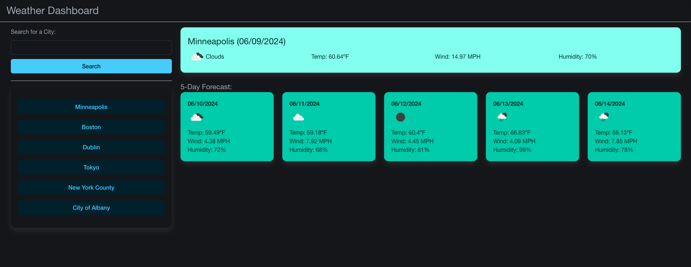

# Weather Dashboard - weatherapp-js

## Purpose

This project is building a dynamic weather app that will look up the weather to a given city name. When a city name is entered, it will display the current weather as well as the next 5 day forecast. On page load, the local city of Minneapolis will load first. All subsequent cities can be searched through the search input on the left and those searches will be saved below.

## Acceptance Criteria

```
GIVEN a weather dashboard with form inputs
WHEN I search for a city
THEN I am presented with current and future conditions for that city and that city is added to the search history
WHEN I view current weather conditions for that city
THEN I am presented with the city name, the date, an icon representation of weather conditions, the temperature, the humidity, and the wind speed
WHEN I view future weather conditions for that city
THEN I am presented with a 5-day forecast that displays the date, an icon representation of weather conditions, the temperature, the wind speed, and the humidity
WHEN I click on a city in the search history
THEN I am again presented with current and future conditions for that city
```

## Finished Design

The following image shows the web application's appearance:



## Links

This application can be accessed at the links below for the repo and for the live app

[GitHub Repo](https://github.com/mgordon82/weatherapp-js)

[GitHub Pages](https://mgordon82.github.io/weatherapp-js/)
